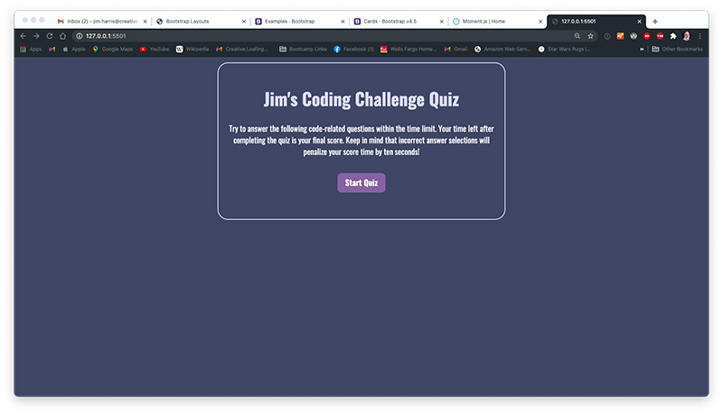
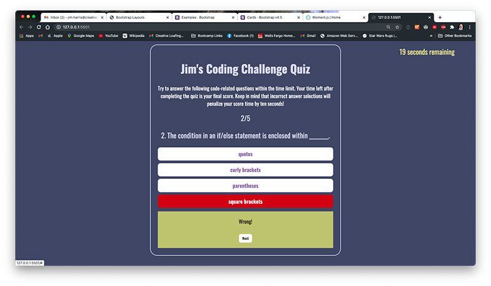
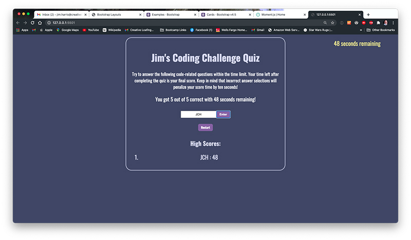

# Jim's Coding Quiz Challenge

## Description

The assignment for this project was to create a dynamic quiz application with a countdown timer and a series of questions on the subject of coding. The UI was to feature multiple choice answers the player could click on to select. The player may only select one answer as once clicked the question is locked. Wrong answer selections were to penalize the player by removing 10 seconds from the timer. Upon completion the player would click the Finish button and be shown their final score. A high score panel was to be presented where the user could enter their initials next to their score with that data stored on a High Scores page.

All feature requests have been implemented for both desktop and mobile device screens.

## Installation

My files can be accessed in the repository [HERE](https://github.com/arcangyl1963/coding-challenge-quiz)
The image below shows the repository where my project files are located:

The web application can be viewed [HERE](https://arcangyl1963.github.io/coding-challenge-quiz/).

The images below shows the various panels of the Coding Quiz Challenge Application: 

The main start screen.

The first questions screen with timer start.

The correct answers display green when selected.

The incorrect answers display red when selected.

The final question displays a Finish button the user must click to stop the timer and end the quiz.

The final screen displays the players score and a Restart button to try the quiz again.

© 2021 arcangyl studios